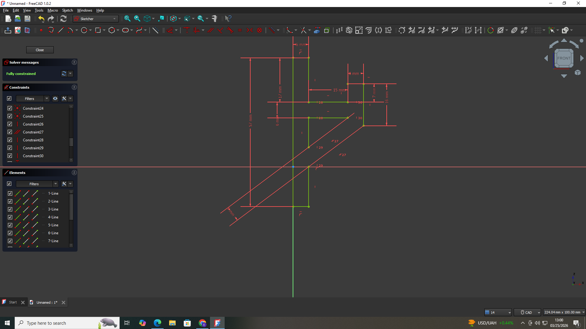
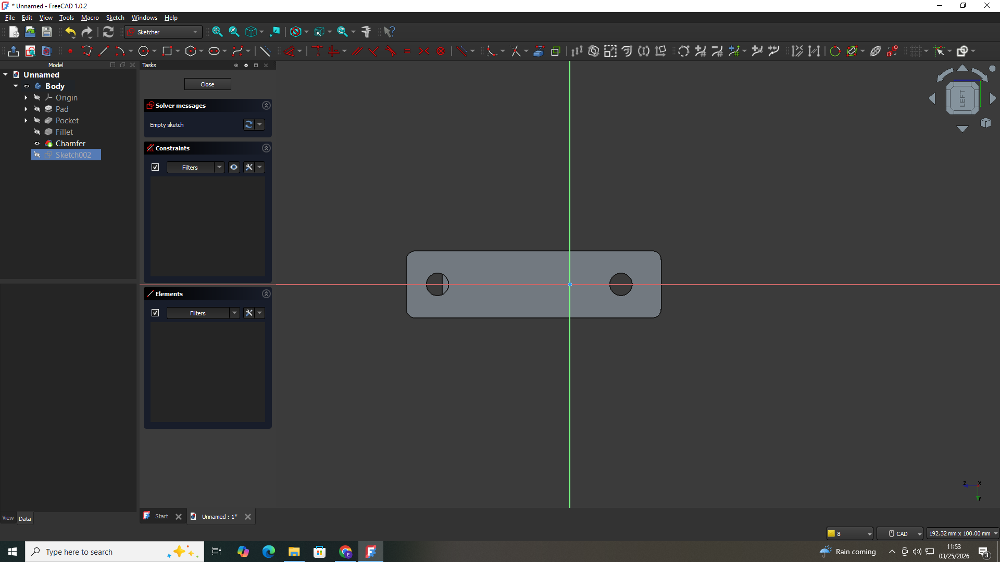

# 2. Activity of Day 2: Digital modeling for Fabrication

# Summary
a digital model is a visual representation of a designed and printed object. it's also a set of instructions for machines. this reduces the issues of fabrication cost failures due to the modeling production in mind.

Precision Modeling and Scale Control Precision modeling scale Control means Accurate Dimensions, Parametric Constrains and Real-World scale. Tools like "FreeCAD" empower designers with exact measurements, constraint-based sketches, and editable parameters, translating conceptual designs into tangible realities with unwavering accuracy
##  3D Modeling for Fabrication 
Key Practices: 
• Fully constrained sketches prevent unintended changes.

• Parametric dimensions allow for easy design modifications.

• Exclusive use of solid modeling ensures physical integrity.

A visually correct model may still be fabrication-incorrect. Focus on structural integrity and machine readability, not just aesthetic appeal, to guarantee successful physical output.

### 1. Activity 1: Designing L-shaped wall hook (3D) using FreeCad application
The activity is to design the model for being able to print it. using FreeCad app, the selected model is first designed in 2 dimension and then the resulted shape is modified with in 3D space. The following image shows the picture of the L-Shaped Mounting Bracket model designed using FreeCAD application.

#### Designing the wall hook using FreeCad platform.
{ width=400 Height=300 align=middle }

#### From this picture, shows the first steps of desining, this is how i manupulate the tool bars using the lines adjusting the the geometric figure, removing all the constraints and finalizing the first symetric figure.

{ width=400 Height=300 align=middle }

#### This shows exactly how i design the holes for where the nails are going to be while holding it on a wall.

{ width=400 Height=300 align=middle }

#### From the provided picture its showing by using this software u can design a 3D shapped device of your own, but for me i was required to design a L-shaped wall hook,This above picture  Is the final prototype of what i'm supposed to design.

### 2. Activity 2: Press-Fit Box Panel (2D Vector) model design
As learners we are required to recognize the A flat rectangular panel, Rectangular slots cut into the edges, Slots sized to match material thickness and also the Entirely 2D vector geometry. these all task must be completed in Inkscape software which very suitable to this manuals. The following image illustrate the work done through Inkscape app for the 2D vector model design for the press-Fit Box.

## Research

"Lorem ipsum dolor sit amet, consectetur adipiscing elit, sed do eiusmod tempor incididunt ut labore et dolore magna aliqua. Ut enim ad minim veniam, quis nostrud exercitation ullamco laboris nisi ut aliquip ex ea commodo consequat. Duis aute irure dolor in reprehenderit in voluptate velit esse cillum dolore eu fugiat nulla pariatur. Excepteur sint occaecat cupidatat non proident, sunt in culpa qui officia deserunt mollit anim id est laborum."

## References & Inspiration

"Lorem ipsum dolor sit amet, consectetur adipiscing elit, sed do eiusmod tempor incididunt ut labore et dolore magna aliqua. Ut enim ad minim veniam, quis nostrud exercitation ullamco laboris nisi ut aliquip ex ea commodo consequat. Duis aute irure dolor in reprehenderit in voluptate velit esse cillum dolore eu fugiat nulla pariatur. Excepteur sint occaecat cupidatat non proident, sunt in culpa qui officia deserunt mollit anim id est laborum."

# Reference

### 📄 Project Document
Click below to view the  FreeCAD file:
[View on Google Drive](https://drive.google.com/file/d/16lQZIhe1CCdjZkD-eGQtEjid_07mSngf/view?usp=sharing)

Links to reference files, PDF, booklets,

