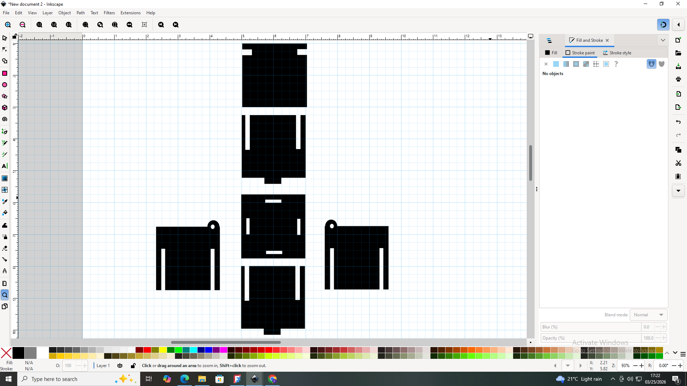
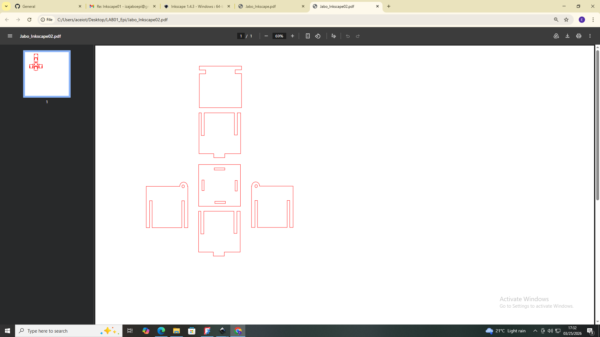

# 2. Activity of Day 2: Digital modeling for Fabrication

# Summary
a digital model is a visual representation of a designed and printed object. it's also a set of instructions for machines. this reduces the issues of fabrication cost failures due to the modeling production in mind.

Precision Modeling and Scale Control Precision modeling scale Control means Accurate Dimensions, Parametric Constrains and Real-World scale. Tools like "FreeCAD" empower designers with exact measurements, constraint-based sketches, and editable parameters, translating conceptual designs into tangible realities with unwavering accuracy
##  3D Modeling for Fabrication 
Key Practices: 
• Fully constrained sketches prevent unintended changes.

• Parametric dimensions allow for easy design modifications.

• Exclusive use of solid modeling ensures physical integrity.

A visually correct model may still be fabrication-incorrect. Focus on structural integrity and machine readability, not just aesthetic appeal, to guarantee successful physical output.

### 1. Activity 1: Designing L-shaped wall hook (3D) using FreeCad application
The activity is to design the model for being able to print it. using FreeCad app, the selected model is first designed in 2 dimension and then the resulted shape is modified with in 3D space. The following image shows the picture of the L-Shaped Mounting Bracket model designed using FreeCAD application.

#### Designing the wall hook using FreeCad platform.
{ width=400 Height=300 align=middle }

#### From this picture, shows the first steps of desining, this is how i manupulate the tool bars using the lines adjusting the the geometric figure, removing all the constraints and finalizing the first symetric figure.

{ width=400 Height=300 align=middle }

#### This shows exactly how i design the holes for where the nails are going to be while holding it on a wall.

{ width=400 Height=300 align=middle }

#### From the provided picture its showing by using this software u can design a 3D shapped device of your own, but for me i was required to design a L-shaped wall hook,This above picture  Is the final prototype of what i'm supposed to design.

### 2. Activity 2: Press-Fit Box Panel (2D Vector) model design
As learners we are required to recognize the A flat rectangular panel, Rectangular slots cut into the edges, Slots sized to match material thickness and also the Entirely 2D vector geometry. these all task must be completed in Inkscape software which very suitable to this manuals. The following image illustrate the work done through Inkscape app for the 2D vector model design for the press-Fit Box.

The following image shows the design of a 2Dvector Model of Fit box, where it is designed piece by piece. After the complention of the design the box-part can be assembled to give a 3D image of the box. 
{ width=400 Height=300 align=middle }

These box parts in order to have a final product, they are then modified to what a laser cutter can understand, this means that the edges are triggered for alligning with what cutting path must be followed. the following image shows what i'm saying.
{ width=400 Height=300 align=middle }

## A Take Home
1. For the first activity, now i'm able to design my own prototype, Modifying every edge of it, give the prototype measurable shape that i want and be able to come up with a final 3D device that can be Printed.

2. For the second activity, To be able to design different Parts of the prototype by understanding every role of each part and to be able to understand the complexity of the Device or the design that i made.

# Reference

#### 📄 Project Document
Click below to view the  FreeCAD file:
[View on Google Drive](https://drive.google.com/file/d/16lQZIhe1CCdjZkD-eGQtEjid_07mSngf/view?usp=sharing)

Click bellow to view the Inkscape File:
[View on Google Drive](https://drive.google.com/file/d/1MMp_cUckFDZwmSql9YmwS3PQE6P4iXeD/view?usp=drive_link)

#### Downloadable file for :
#### 1, FreeCAD project:
[⬇️ Download my document](https://drive.google.com/uc?export=download&id=16lQZIhe1CCdjZkD-eGQtEjid_07mSngf)

#### 2, Inkscape project:
[⬇️ Download file](https://drive.google.com/uc?export=download&id=1MMp_cUckFDZwmSql9YmwS3PQE6P4iXeD)