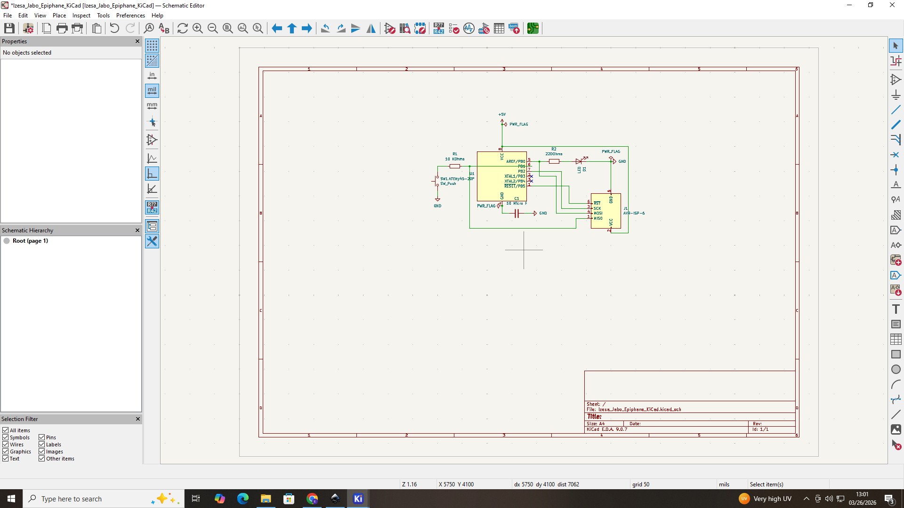
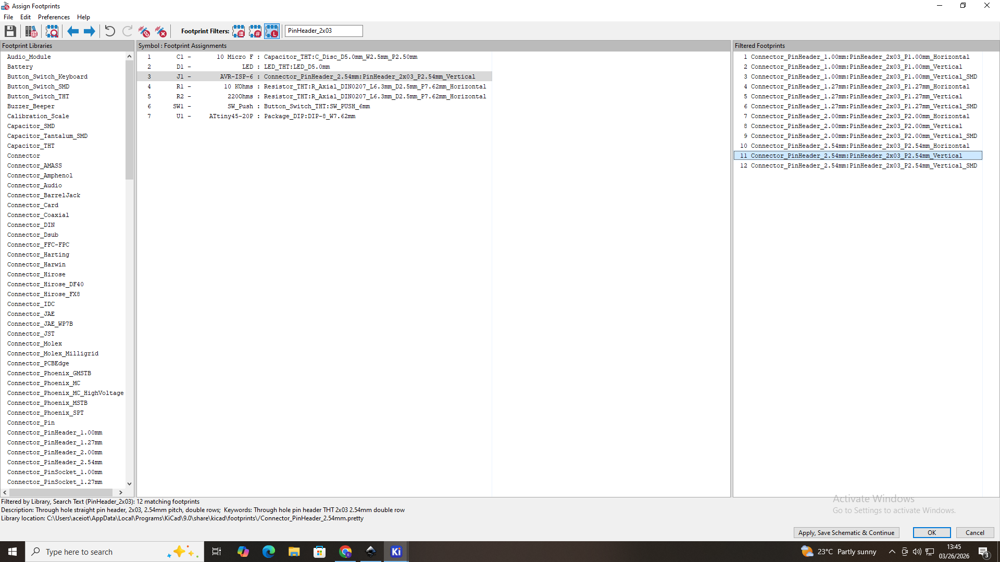
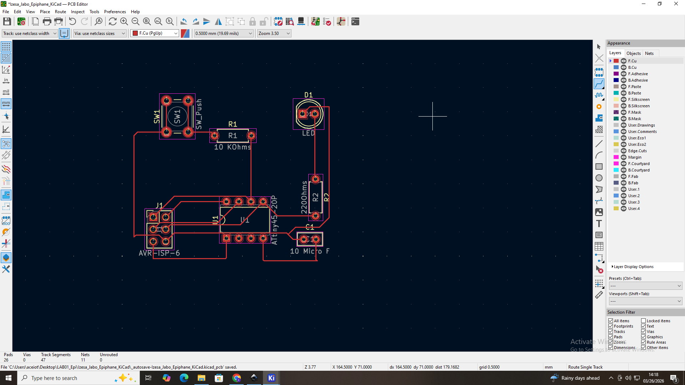
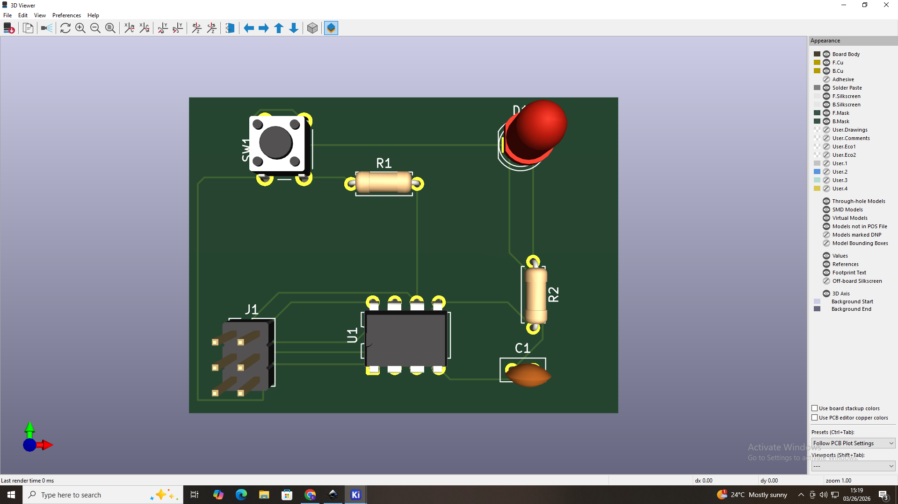
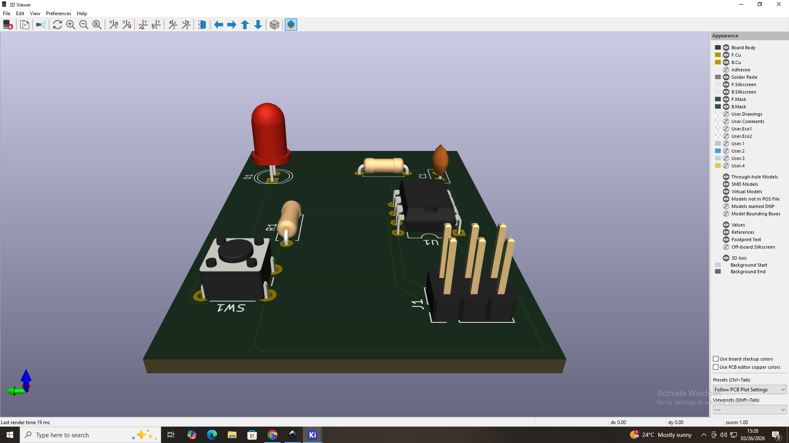

# 3. Activity of Day 3: PCB Milling and Fabrication Process
# Introduction & Summary

On day 3, we start with a new lesson with an activity of PCB designing with KiCad from schematic which means circuit designing to the Fabrication-Rady PCB.
#### What is PCB?
PCB in full words means Printed Circuit Board. It is a foundational component in electronics that mechanically supports an electrically connects electronic components using conductive paths, or traces, etched from copper sheets laminated onto a non-conductive substrate.

#### PCB Milling is a manufacturing process that uses a CNC machine to physically carve away unwanted copper from a substrate to create conductivetracks, pads and isolation paths.

## STEP 1: Designing the schematic(Circuit diagram) of what i want to be on the PCB Board.
I'm going to design a Single-Side Microcontroller PCB Design using KiCad. the objective for me as a leaner is to design a single-side Pcb that:
1. uses an ATtiny 45 Microcontroller
2. Controls an LED using a push button 
3. can be programmable via a 6-pin ISP header
4. is suitable for PCB Milling and hand soldering.

from those objectives, they will help me to accomplish this  first task of designing the circuit diagram of my PCB board.

After runing the ERC which means Electrical Rules Checker to insure that my circuit is well connected this image shows what  it look like.

{ width=400 Height=300 align=middle }

## STEP 2: Assigning Footprints from the finished Circuit Diagram.
This step is for assigning the real functions of the devices that i have with what makes them connected . the following picture will show how i assigned every components with their corresponding libraries.

{ width=400 Height=300 align=middle }

After assigning footprints i click "Apply,Save and continue" and click F8 for updating PCB to go to the next step of PCB Layout.

## STEP3: Single-Sided PCB Layout(Placement and Routing)
After updating the PCB design, now i placed the component in the order for me to easly do routing methods. the following picture will show exactly how i placed them and how i did routing.

{ width=400 Height=300 align=middle }

After that i checked my design if it is with no errors where i clicked the Design Rules Checker, after that i got a challenge that the board has malformed outline(no edges found on Edge.cuts Layer)

## STEP 4: Design Rule Check
The solution to that challenge is selected the Edge.Cuts Before implementing the Routing process. the following image shows the corrected PCB Layout desing with corresponding Edge Cuts.

{ width=400 Height=300 align=middle}
#### This is a PCB Layout design which is corrected by Design Rule Checker with no errors.

## STEP 5: Prepare for Fabrication.
As the PCB Layout design is done, the project is coming to an end. the following image show what it should look like on the a 3D viewer, how our Board is designed and what components are on the PCB board.

{ width=400 Height=300}{ width=400 Height=300}

For this last step the next thing is to generate Gerber files and drill files for printing the output correctly.

#### Take Home
To be able to design a PCB board according to the instructions needed for that chip or prototype that is an stable and embedded board with multiple electronic components. As an embedded computing system engineer this is a crucial lesson which help me to have skills on how to design and implement the creation of an embedded device.

## References 

#### Downloadable file for KiCad Project:

#### 1, KiCad project:
[⬇️ Download my document](https://drive.google.com/uc?export=download&id=1YQflEabkxwM6uv8QpX_p1oHiknjVnP5F)

