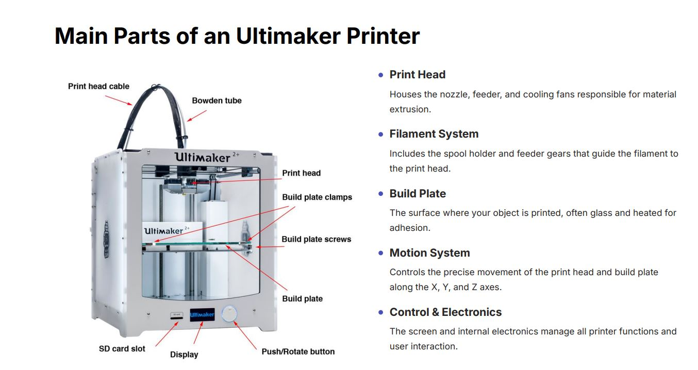
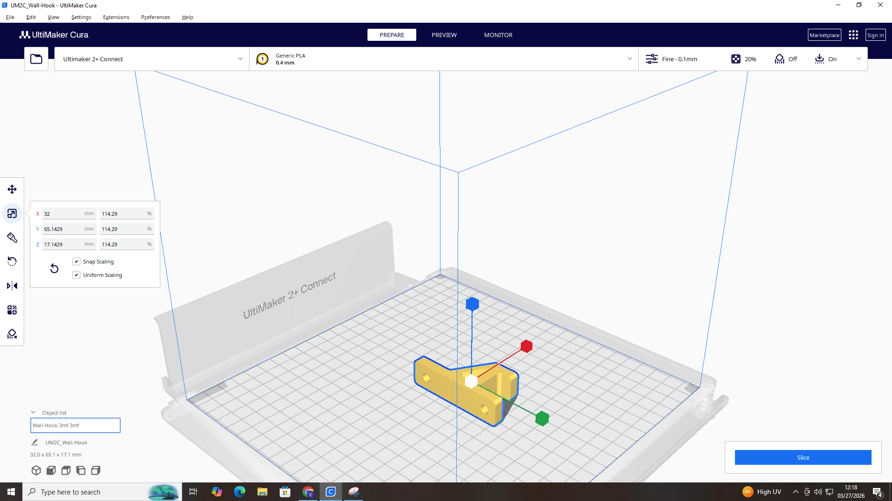
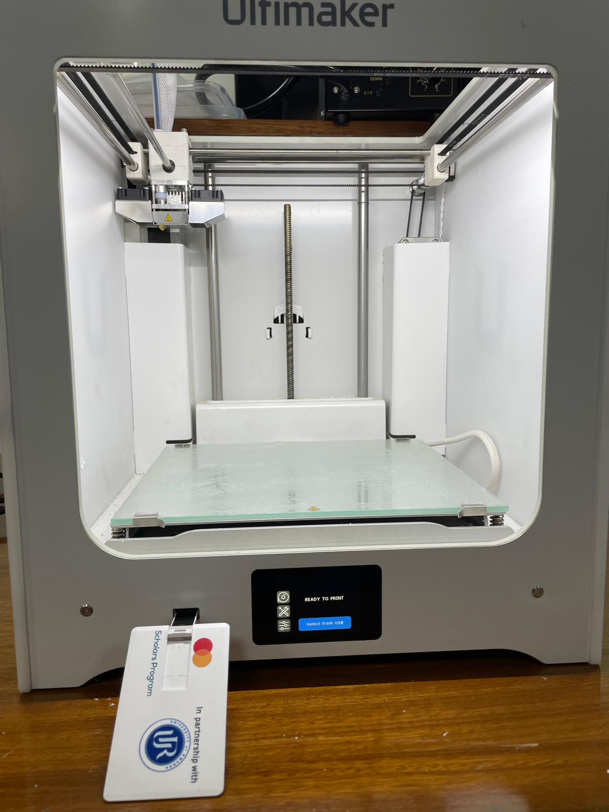
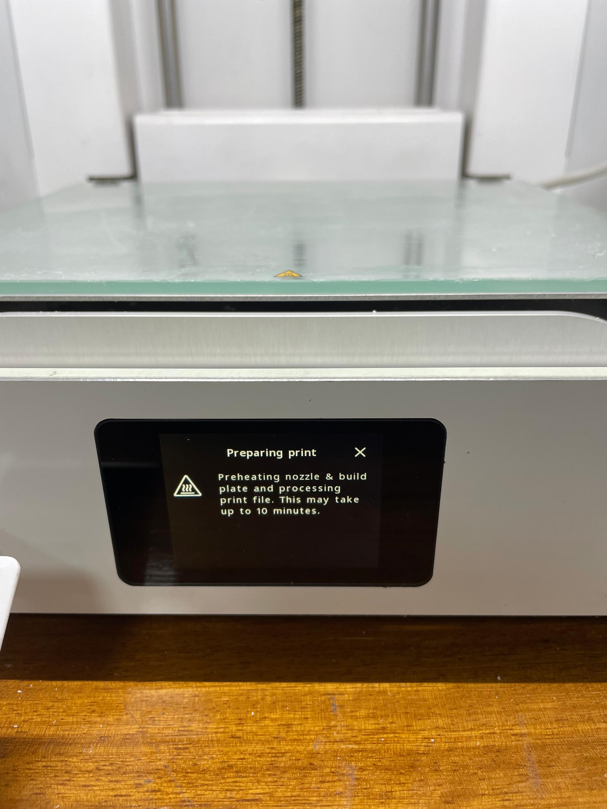
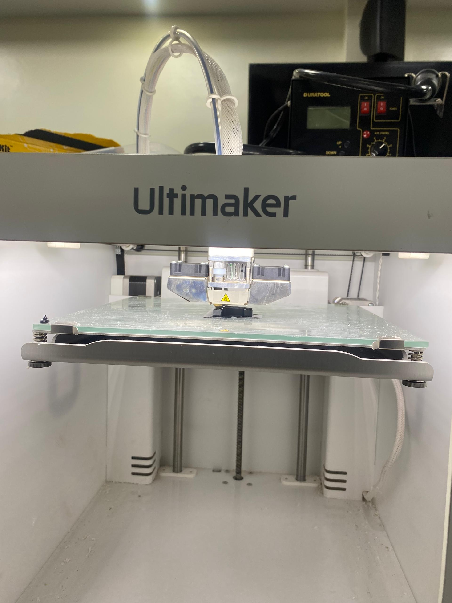
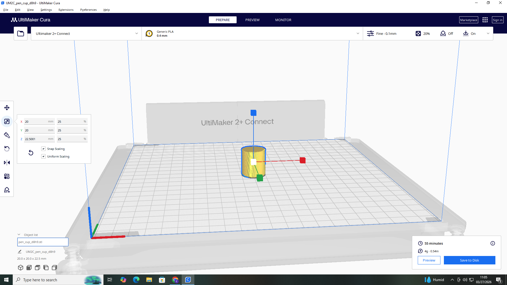
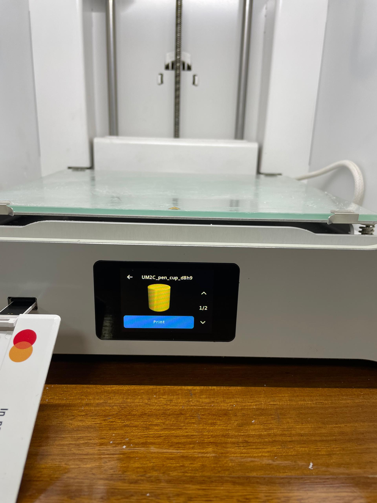
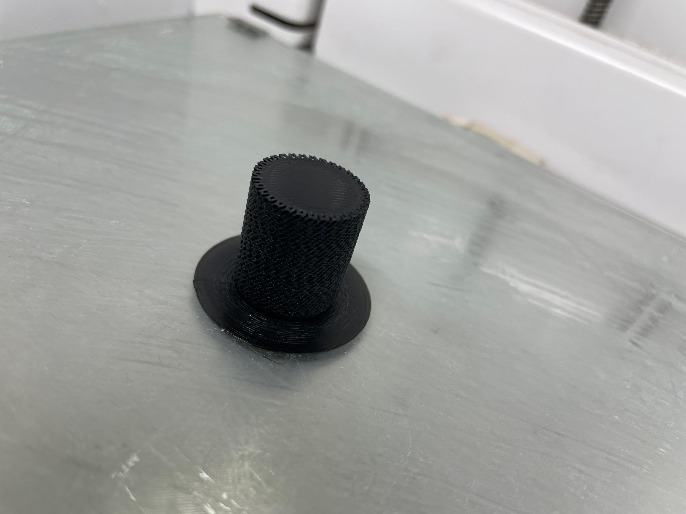
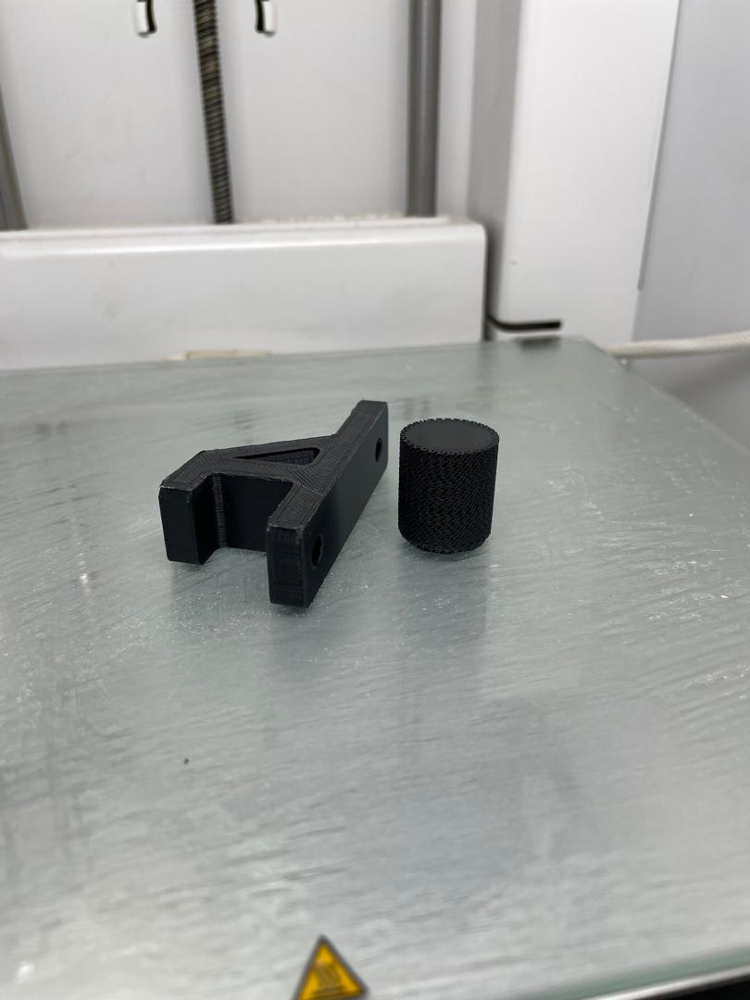

# 6. Activity of Day 6: Digital Fabrication II: Additive Manufacturing.
## 1. Introduction with a Summary.
Additive Manufacturing is a Fabrication Paradigm, where the process of manufacyuring occurs by adding Layers by Layers. this means that in order to obtain the final product; there have been layers of work that are all added together.

## 2. 3P Printer Operation-Ultimaker.
This is a printing Machine that help the user to obtain his or her prototype from Digital Model to printed object. This devices build objects layer by layer, adding material sequentially based on the digital design.
**Ultimaker Printers** Utilize **Fused Deposition Modeling** where it melts and extruding plastic filaments. by melting the plastic filaments, they desolve into a hot liquid which easily help the construction of design.

## 3. Main Parts of Ultimaker Printer
the following parts are what makes An Ultimaker Printer a 3D printer . the Following Picture is going to illustrate clearly with a picture all parts that makes this 3D priinter.

{ width=600 Height=500 align=middle }

## 4. Materials Used with Ultimaker.
This is consist of different variation of fillaments that are used in printing different designs. Here it is very crucial to identify a suitable type of fillament that will allow me to print correctly my design.

1. **PLA(Polylactic Acid)** :is Easy to print, biodegradable and ideal for general- purpose models and prototyping.
2. **ABS(Acrylonitrile Butadiene Styrene)** :this one is strong, Durable and temperature- resistant and often used for functional parts.
3. **PETG(Polyethylene Terephthalate Glycol)** :this one combines the flexibility of PLA and the strenght of ABS and offering good impact resistance. this is often used for sofisticated design models.
4. **TPU(Thermoplastic Polyurethane)** :A flexible filament, perfect for Producingpliable parts like Phone cases or seals.

These are the main printing materials that are being used by the Ultimaker Printer.

Now let's focus on the steps and procedures needed from Digital Fabrication model design to printed Prototype or final production.

## 5. Setps required while using a 3D printer like Ultimaker.
### STEP1: Preparing The Digital Model.
the first step is to prepare the Model that i want to print. this comes with the same activity done during day2. First i have a designed model ready to be printed. 
The next thing is to Download my 3D model in format like **STL** or **OBJ** and after import that model into Ultimaker Cura as shown in the picture bellow:

{ width=400 Height=300 align=middle }

AFter selecting, Slicing my models for obtaining a period of time needed to print that design.
### STEP 2: Printer setup and Calibration.
After preparing the design Model, now i'm going to setup the Printer, to make the Printer ready for the printing process.
1. first thing to do is **Loading Fillament** which means carefully feeding the filament into the designated extruder path until it's properly seated.
2. Second thing is to ensure the **Build plate** is perfectly level, using automatic calibration.
3. Third is to wipe the Build plate with alcohol to remove any oils or debris that could hinder adhesion.
4. Preheat Printer, allowing nozzle and build plate to reach their target temperatures before starting the print. this Two  following pictures shows the summary of these process up to this one:

{ width=400 Height=300 align=middle }
{ width=400 Height=300 align=middle }

5. Finally test print, for making sure everything is in good condition. I have to run a small test print to verify settings and callibration before the main job.

### STEP 3: Printing Process.
Once the 3D printer is prepared, it will bring my digital Design to life. in the Printing process there are different steps also that are followed t=by the printer itself. these are **initiate Print**, **Monitor first layers**, **layer-by-layer construction** and **Cooling Fans** that regulate the cooling of extruded plastics.

{ width=400 Height=300 align=middle }
#### this is the picture showing  the printing process for that digital Model design of the Wall hook.

{ width=400 Height=300 align=middle }
#### this is the final product, printed Wall hook which was designed in Day 2 activity and now came to life.

## Safety and Best Parctices.
 The following are the most effective Safety procedures to do during the Printing process:
#### Watch for Heat:
Avoiding touching the build surface for preventing burns
#### Ensure ventilation:
Use your printer in a well- ventillated area to dissipate fumes from melting. this means that the Lab is best place to do it so.
#### Supervise long prints:
Checking the 3D printer for extended periods of printing.

#### Other Additional printing of my work for better understanding.
The following pictures will explain from digital model to final product of the other device that i have done for more understanding.

{ width=400 Height=300 align=middle }
#### This is the Digital Model of my other work.

{ width=400 Height=300 align=middle }
#### This Image shows the process of preparing and setting up the 3D printer for printing my device as shown.

{ width=400 Height=300 align=middle }
#### The final prototype of my second work on this activity of digital fabrication using additive Manufacturing paradigm.

{ width=400 Height=300 align=middle }
### This is the two final products of my Day6 activity.

