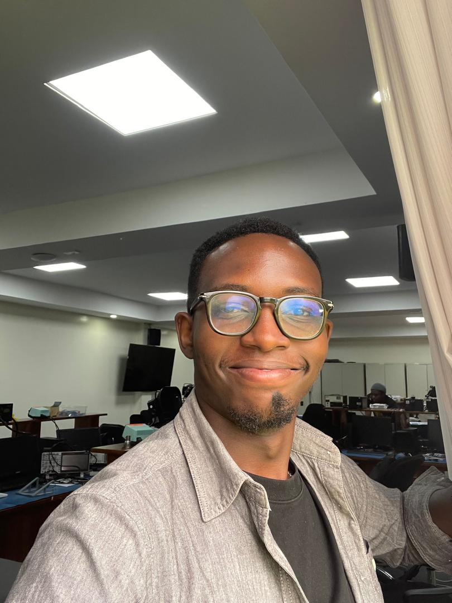

# My documentation

This is considered as the documentation of my entire activity during this Lesson known as " Fabrication and Modeling Techniques" where it illustrate different/various techniques of designing embedded systems and also packaging. from this documentation, there will be different Lab activities which showes how a devices is designed,modified, put-to life and printed for physical observation and use.

## The course overview 

The Objective of these Lesson is to  implement Digital fabrication links digital design and physical production through computer-controlled tools such as CNC machines, laser cutters, and 3D printers. It evolved from manual craft and industrial manufacturing to enable rapid prototyping, precision, iteration, and hybrid workflows, transforming fabrication into an accessible process for innovation, education, and localized production.

## My Objectives.
### 1. To understand the foundations of Modeling and Fabrication.
 The main Role of Modeling in advanced design and fabrications, every approaches related either from Analog to Digital designing, to be able to understand all steps for design work flow.

### 2. Precision modeling and scale control.
To be able to design a prototype by using the Designing tools like FreeCAD. making a prototype from scratch that can be printable, which is also considered as Fabrication-Ready geometry. where also there is an observation of designing tool like "Inkscape" where a design of different shapes which at the end are emerged to become one Prototype at the end.

### 3. PCB Milling Techniques and Fabrication Process.
To be able to design a Single-Sided Microcontroller PCB Design ( using "KiCad" as a designing tool) where it will be a ATtiny45 LED Control with Push Button & ISP Programming, Printing the implemented PCB board in a 3D printer specifically for the PCB. One that is used is called NOMAD. 

### 4. Materials and Fabrication Methodes.
To understand the Materials that are being used in the fabrication process through all Lab activities. what materials are used for the 3D printing devices like Ultimaker, to understand the difference of qualities and what is suitable to the project like what type of material to be used on a specified Fabrication project

### 5. Understanding CNC & Laser Cutting Procedures.
understaning the CNC machining principles, laser cutting workfloww and constraints, and assembly methodes for flat-fabricated parts.

### 6. Additive Manufacturing.
here is to be able to manufacture other prototypes by my own and be able to print them using Ultimaker 3D printer. Here is to apply the Knowledge that i obtained from all the lab activities in order for me to be able to do Something on my own.

### 7. CNC Router Milling & Cutting
 understanding PCB Milling Process Using Carbide Nomad 3 CNC, to be able to identify materials used to cut and milling the diferences between them and to understand the role for each.

## About me

{ width=200 align=right }

Hi! I am IZESA JABO Epiphane. I am a postgraduate candidate at Universisty of Rwanda, College of Science and Technology, African Center Of Excellency in Internet of Things. My specialisation is in Embedded computing Systems

## My background

I was born in a Rwanda , raised in rwanda, grow up in Huye city a small town in southern province which was full of academic motivation at that time, every children was motivated to study.

  

